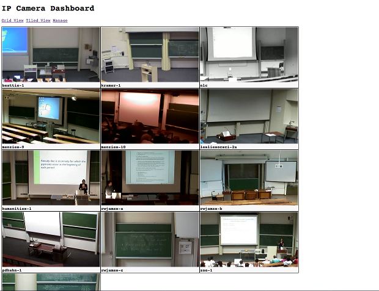

Display IP camera feeds retrieved over RTSP

Technologies Used:
- Sinatra
- Redis
- openRTSP
- ffmpeg
- Thin
- Go

PS : Don't forget to copy the example file and put in your desired authentication cridentials
> cp matterhornconfig.example.rb matterhornconfig.rb

